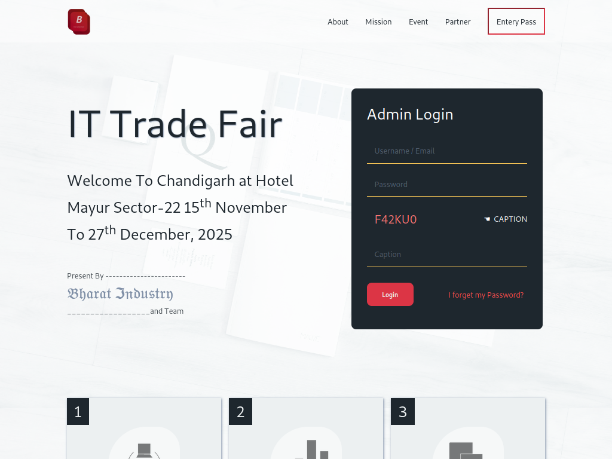

# website-2

- Name : "Trade Fair"

- Description : "create fake Trade Fair website it task at 11 class give by teachers"

- Version : main

- Update : 01-01-2024

- Status : REST

- Responsive : Ture

- TecStack : { HTML | CSS | JavaScript }

- Thanks : { VSCode | GitHub | GoogleFont }

- Work : Self

- Design : { Mayank }

- Developer : { Mayank }

- CopyRight : { Mayank | Bhart Indaustry }

- URL : https://mayankdevil.github.io/TradeFair/

- Clone : https://github.com/MayankDevil/TradeFair.git

- Download : https://github.com/MayankDevil/TradeFair/archive/refs/heads/main.zip

---

### Home Page

### Responsive

**Breakpoints** { 375 | 576 | 768 | 992 | 1200 }

### Theme Mode

_Great white and black theme with red colour contraus and lite yellow colour touch._

# --------
# RESERACH 
# --------

Creating a trade fair website involves several key elements to effectively showcase the event, attract exhibitors and visitors, and provide essential information. Here's a general guide on what you might include:

1. **Homepage:**
   - Brief introduction to the trade fair.
   - Eye-catching visuals, possibly a banner or carousel highlighting key aspects.
   - Dates, venue, and a countdown timer if relevant.

2. **About the Trade Fair:**
   - Detailed information about the event, its history, and objectives.
   - Overview of previous successful editions (if applicable).
   - Mission and goals.

3. **Exhibitor Information:**
   - Registration details for exhibitors.
   - Benefits of exhibiting (networking opportunities, exposure, etc.).
   - Floor plan or booth layout.
   - Application process and deadlines.

4. **Visitor Information:**
   - Registration process for attendees.
   - Benefits of attending (networking, product launches, industry insights).
   - Ticket prices, if applicable.
   - Any special events or conferences during the fair.

5. **Schedule and Agenda:**
   - Detailed schedule of events, including seminars, workshops, and networking sessions.
   - Speaker information and bios.
   - Printable or downloadable agenda.

6. **Sponsors and Partners:**
   - List and details of sponsors and partners.
   - Information about their involvement and contributions.
   - Opportunities for additional sponsors.

7. **Media Center:**
   - Press releases.
   - Media kit with high-resolution images and logos.
   - Contact information for media inquiries.

8. **Contact Information:**
   - Clear contact details for general inquiries, exhibitor support, and visitor support.
   - Contact form for online inquiries.
   - Social media links.

9. **Interactive Features:**
   - Social media integration for sharing and updates.
   - Possibly a live feed of social media posts related to the event.
   - Interactive maps or floor plans.

10. **FAQ Section:**
    - Commonly asked questions with detailed answers.
    - Information on accommodation options for out-of-town visitors.

11. **Accessibility and Logistics:**
    - Venue details, including address, parking information, and public transportation options.
    - Information on accessibility for attendees with special needs.
    - Health and safety guidelines, especially relevant in light of the ongoing global situation.

12. **Registration and Ticketing:**
    - Secure and user-friendly online registration and ticketing system.
    - Payment options and refund policies.

13. **Post-Event Information:**
    - Highlights and photo galleries from the event.
    - Thank you message to participants and attendees.
    - Survey or feedback form for continuous improvement.

14. **Language Options:**
    - If your event attracts an international audience, consider offering the website in multiple languages.

Remember to keep the website visually appealing, easy to navigate, and mobile-friendly. Regularly update the content, especially as the event approaches, to keep participants informed and engaged.

